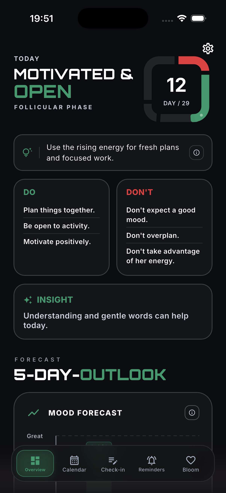

# PhaseParadise, landing page

A single-page site in plain HTML, CSS and JavaScript. No framework, no build
step. Open `index.html` in a browser, or serve the folder with any static
server. Both work.

```
.
├── CNAME
├── index.html
├── policy/
│   └── index.html
├── imprint/
│   └── index.html
└── assets/
    ├── css/
    │   ├── main.css       landing page visual system
    │   └── legal.css      shared UI for /policy/ and /imprint/
    ├── js/
    │   ├── i18n.js        language loading and DOM binding
    │   └── main.js        nav, reveal, parallax and cycle ring behaviour
    ├── locales/
    │   ├── en.js          English strings and fallback copy
    │   └── de.js          German strings
    ├── images/
    │   ├── badges/        store badges
    │   ├── logo/          wordmark, stacked wordmark and icon
    │   ├── mock/          app screenshots, iPhone 16 Pro @3x
    │   └── og/            link-preview image
    └── fonts/             self-hosted webfonts
```

## The six sections

`#hero` · `#benefits` · `#phases` · `#insights` · `#partner-page` · `#cta`

The page runs light. `#phases` and `#cta` go dark on purpose, so the phase
colours glow the way they do inside the app. The nav bar notices those two
sections and swaps to the dark wordmark while it sits over them.

## The one animated moment

`#phases` is the signature: a squircle ring, the same shape as the app icon and
the day counter on the today screen, that draws itself in one phase colour at a
time as you scroll. A marker rides the edge, the day counts 1 to 29, and the
matching line lights up. Everything else on the page is a quiet fade.

The cycle is defined in `assets/js/main.js`:

```js
var PHASES = [
  { start: 0,  days: 5,  color: "#E85150" }, // menstruation
  { start: 5,  days: 8,  color: "#64BC97" }, // follicular
  { start: 13, days: 3,  color: "#FEBC52" }, // ovulation
  { start: 16, days: 13, color: "#A28DEA" }  // luteal
];
var CYCLE_DAYS = 29;
```

`RUNWAY`, in the same file, is how many extra viewports of scrolling the ring
takes to fill. Raise it for a slower reveal, lower it for a quicker one.

Under `prefers-reduced-motion: reduce` the runway is dropped, the ring is drawn
whole, and all four phase lines show at once.

## Languages

No visible text sits in `index.html`. Every string comes from `assets/locales/`,
and elements pick theirs up through a `data-i18n` attribute naming the key:

```html
<p class="lede" data-i18n="hero.lede"></p>

```

| attribute | writes to |
| --- | --- |
| `data-i18n` | the element's text |
| `data-i18n-rich` | its text, with `*accent*` and line breaks |
| `data-i18n-alt` | `alt` |
| `data-i18n-aria` | `aria-label` |
| `data-i18n-content` | `content`, for the meta tags |

Inside a string, `*word*` paints a word in the accent colour and `\n` starts a
new line. Headlines break where the locale file says they break, which is why
`text-wrap: balance` is switched off for them.

**Which language a visitor gets.** An earlier choice, kept in `localStorage`
under `phaseparadise-lang`, wins. Otherwise the browser decides: German gets
German, everyone else gets English. The switcher sits in the header as `DE / EN`
and builds itself from the list in `assets/js/i18n.js`.

**When something goes wrong.** English loads with the page itself, so it is
always in hand. A language file that fails to arrive, or a key nobody
translated yet, falls back to English rather than leaving a gap.

**Adding a language.** Copy `assets/locales/en.js`, translate the values, and add one
line near the top of `assets/js/i18n.js`:

```js
var LANGS = [
  { code: "de", label: "DE", html: "de", og: "de_DE" },
  { code: "fr", label: "FR", html: "fr", og: "fr_FR" },   // new
  { code: "en", label: "EN", html: "en", og: "en_US" }
];
```

The switcher, the `lang` attribute and `og:locale` follow on their own. Keys
must match `en.js` exactly; anything you leave out shows in English.

The meta tags in `index.html` carry the English wording as a starting value and
are rewritten once a language is picked. They stay in the markup so link
previews keep working for scrapers that never run JavaScript.

## Swapping things out

**Screenshots.** Every phone is the same markup:

```html
<div class="device">
  <div class="device__frame">
    <div class="device__screen">
      
    </div>
  </div>
</div>
```

Drop a new file into `assets/images/mock/` and change the `src`. Anything with the
402 : 874 aspect ratio of an iPhone 16 Pro fits without cropping. Each ``
in `index.html` carries a `<!-- SWAP: … -->` comment saying what it shows. Phone
size is set per section with `--dw`, and the frame radii scale off it.

**The partner page.** The front phone uses `assets/images/mock/partner_1.png`. Replace
that file with a new 1206 × 2622 screenshot when the app screen changes.

**Store links.** The App Store and Google Play badges point to the live store
listings. The Android bundle id still carries the old PhaseBloom name:
`com.monkeyttack.phaseBloom`.

**Store badges.** `assets/images/badges/app-store.svg` and `google-play.svg` are drawn
to Apple's and Google's proportions. Replace them with the official downloads
from Apple's Marketing Resources and Google's Play Badge generator before you
publish. Same filenames, same 180 × 60 box, nothing else changes. Both stores
also publish German artwork, and the German alt text already reads *Laden im App
Store* and *Jetzt bei Google Play*, so the badge image is the only piece left to
swap per language.

**Link preview.** `assets/images/og/og-image.png` is referenced by the `og:image` and
`twitter:image` tags. Regenerate it however you like at 1200 × 630.

## Colours

All tokens sit at the top of `assets/css/main.css`. Two rules govern their use:

- **Green** (`--phase-follicular`) is the accent. On light backgrounds it goes
  through `--accent`, which points at `--phase-follicular-dark`, because the
  lighter tint does not carry enough contrast on `#F8F9FA`.
- **Orange** (`--brand-accent`) belongs to the call to action: the badge hover
  glow, focus rings, text selection, and the wordmark. It appears nowhere else.

## Notes

- Fonts are self-hosted in `assets/fonts/`: Archivo (variable, with the width
  axis, and display type sits at `font-stretch: 125%` for the brand's wide
  squared look) and IBM Plex Mono for labels.
- The copyright year comes from the visitor's clock, so it never needs touching.
- Checked for horizontal overflow from 320 px to 1920 px in both languages.
- Without JavaScript the page cannot fetch its own text, so it shows a short
  note instead.
