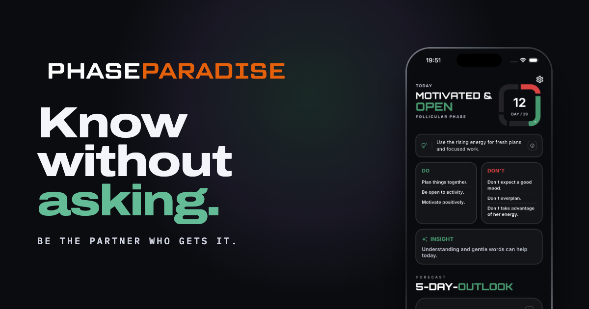

# PhaseParadise Website

The marketing website for PhaseParadise, an iOS and Android app that helps men
understand their partner's cycle and support her through its four phases.

**Live at [phaseparadise.app](https://phaseparadise.app)**


## Description

A static website: a one-page landing page plus a privacy policy in English and
German, and an imprint. It is written in plain HTML, CSS and JavaScript with no framework,
no package manager and no build step. What is in the repository is exactly what
gets served.

Key points:

- **Two languages.** English and German. Every visible string on the landing
  page lives in `assets/locales/`, not in the HTML.
- **No external requests.** Fonts are self-hosted, so the site does not call out
  to Google Fonts or any CDN at runtime.
- **Works offline.** Opening `index.html` from disk shows the full site.
- **Landing page sections:** `#hero`, `#benefits`, `#phases`, `#insights`,
  `#partner-page`, `#cta`.

## Screenshot



## Requirements

A text editor and a browser. Nothing else, as long as you are editing text,
styles or behaviour.

**Replacing a screenshot needs one tool**, because the files the page loads are
generated from the originals:

```bash
brew install webp          # once, gives you cwebp
```

A static web server is optional. Python 3 ships with macOS and most Linux
distributions and is enough if you want one.

## Running locally

Clone the repository and open the entry page:

```bash
git clone <repository-url>
cd Web
open index.html          # macOS; use `xdg-open` on Linux or `start` on Windows
```

To serve it over HTTP instead, for example to test the legal pages at their real
URLs:

```bash
python3 -m http.server 8000
```

Then open <http://localhost:8000>.

Editing the page needs no install step and no watch task: change a file, reload
the browser.

### Do not forget: screenshots are generated

The page does **not** load the PNG files you drop in. It loads `.webp` files
built from them. Put the original in `assets/images/mock/_src/<language>/`,
then run:

```bash
./tools/build-shots.sh
```

Then commit three things: the new PNG, the generated `.webp`, and the updated
`tools/shots.lock`.

Skip this and the page keeps showing the old screenshot, or an empty phone if
the file is new. CI catches it on push, but only after the fact — running the
script is the shorter path. `./tools/build-shots.sh --check` tells you where
you stand without changing anything.

Details in [Replacing screenshots](#replacing-screenshots).

## Project structure

```
.
├── CNAME                   custom domain for GitHub Pages
├── .nojekyll               tells GitHub Pages to serve files as-is
├── .lighthouserc.json      performance budget CI holds the page to
├── .github/workflows/      CI: screenshots current, budget met
├── favicon.ico             16/32/48, asked for by convention, not linked
├── tools/
│   ├── build-shots.sh      originals → the WebP the page loads
│   ├── shots.lock          which original each WebP was built from
│   └── build-icons.py      logo → favicon set (run by hand, needs Pillow)
├── index.html              landing page
├── policy/index.html       privacy policy, English (standalone)
├── policy/de/index.html    privacy policy, German (standalone)
├── imprint/index.html      imprint (standalone, English only)
└── assets/
    ├── css/
    │   ├── main.css        landing page visual system
    │   └── legal.css       shared UI for /policy/ and /imprint/
    ├── js/
    │   ├── i18n.js         language loading and DOM binding
    │   └── main.js         nav, reveal, parallax and cycle ring behaviour
    ├── locales/
    │   ├── en.js           English strings, and the fallback for every language
    │   └── de.js           German strings
    ├── fonts/              self-hosted Archivo and IBM Plex Mono (woff2)
    └── images/
        ├── badges/         App Store and Google Play badges (SVG)
        ├── logo/           wordmark, stacked wordmark and icon
        ├── mock/
        │   ├── _src/       screenshot originals, PNG at 1206 × 2622,
        │   │               one folder per language. Never loaded.
        │   ├── de/         built WebP at 960 px, this is what ships
        │   └── en/
        └── og/             link preview image, 1200 × 630
```

## Usage

### Editing text

No visible text is written in `index.html`. Elements name a key, and `i18n.js`
fills them in:

```html
<p class="lede" data-i18n="hero.lede"></p>

```

To change wording, edit the matching key in **both** `assets/locales/en.js` and
`assets/locales/de.js`.

| Attribute | Sets |
| --- | --- |
| `data-i18n` | the element's text |
| `data-i18n-rich` | the element's text, with `*accent*` and line breaks |
| `data-i18n-alt` | the `alt` attribute |
| `data-i18n-aria` | the `aria-label` attribute |
| `data-i18n-content` | the `content` attribute, used for meta tags |
| `data-i18n-href` | the `href` attribute, used to point a link at the right language |

Two conventions apply inside a string:

- `*word*` renders the word in the green accent colour.
- `\n` starts a new line in a headline.

Headlines break exactly where the locale file says. This is why
`text-wrap: balance` is switched off for them in `main.css`.

### Language selection

1. A previous choice stored in `localStorage` under `phaseparadise-lang` wins.
2. Otherwise the browser language decides: German gets German, everything else
   gets English.

English is bundled with the page and acts as the safety net. If a language file
fails to load, or a key has not been translated yet, English is shown instead of
an empty element.

### Adding a language

1. Copy `assets/locales/en.js` to `assets/locales/<code>.js` and translate the
   values. Keep the keys identical; any key you leave out falls back to English.
2. Copy `assets/images/mock/_src/en/` to `assets/images/mock/_src/<code>/` and
   replace the originals with screenshots taken in that language. Keep the file
   names identical, then run `./tools/build-shots.sh` to generate what the page
   will actually load.
3. Add one line to `LANGS` at the top of `assets/js/i18n.js`:

```js
var LANGS = [
  { code: "de", label: "DE", html: "de", og: "de_DE" },
  { code: "fr", label: "FR", html: "fr", og: "fr_FR" },   // new
  { code: "en", label: "EN", html: "en", og: "en_US" }
];
```

The header switcher, the `lang` attribute and the `og:locale` meta tag update
themselves from that list.

One more place needs the new code: the inline script in the head of `index.html`
keeps a short copy of the language list, so it can preload the hero screenshot
before `i18n.js` has run. Leaving it out is not a breakage, the visitor just
downloads one screenshot they never see.

`policy/` and `imprint/` are standalone pages and are not part of this system.
The privacy policy exists twice, as `policy/` and `policy/de/`, each a complete
document that carries its own copy. The two are linked to each other by an
EN / DE pair in the top row and by `hreflang` tags in the head, and the footer
link on the landing page points at whichever one matches the chosen language
through `footer.privacyHref`. Keeping legal text out of the JavaScript layer
means it still reads correctly with scripting switched off. The imprint is
English only.

### Replacing screenshots

Every phone on the page uses the same markup:

```html
<div class="device">
  <div class="device__frame">
    <div class="device__screen">
      
    </div>
  </div>
</div>
```

There is no `src` in the markup. `data-shot` names the screen, and `i18n.js`
builds the path as `assets/images/mock/<language>/<shot>.webp` when it paints,
so the screenshots change language along with the text. Every shot therefore
has to exist under the same name in every language folder. The image fades up
over the black panel once it arrives; on a language switch the shot that is up
stays visible until its replacement has loaded, so there is no blink.

**The files the page loads are generated.** Put the original PNG, at whatever
size your device produced, into `assets/images/mock/_src/<language>/`, then:

```sh
brew install webp          # once
./tools/build-shots.sh
```

That writes `assets/images/mock/<language>/<name>.webp` at 960 px and quality
80 — three times the largest size any phone on the page is drawn at, which is
where the encoder stops buying visible detail. It cuts roughly 88 % off a PNG:
the whole set went from 3.0 MB to 382 KB without a visible difference.

Run it as often as you like. `tools/shots.lock` records the hash of the
original each WebP was built from, so a second run does nothing, and a
screenshot you replaced is the only one re-encoded. `--check` reports
without writing, which is what CI runs.

Screenshots with the 402 : 874 aspect ratio of an iPhone 16 Pro fit without
cropping. Commit both the original and the built file.

Each of these images has a `<!-- SWAP: … -->` comment above it naming the screen
it shows, because the file names alone do not say which is which:

| Comment | `data-shot` |
| --- | --- |
| today screen | `home_1` |
| what is shaping her day | `home_3` |
| check-in history | `checkIns` |
| five day outlook | `home_2` |
| reminders | `reminders` |
| a saved moment in the calendar | `calendar_detail` |
| partner page | `partner` |
| calendar month | `calendar` |

Phone size is set per section through the `--dw` custom property. The frame
corner radii scale off it, so changing one value keeps the proportions.

### The cycle ring

`#phases` contains the one animated moment on the page: a squircle ring, the
same shape as the app icon and the day counter on the today screen, that draws
itself in one phase colour at a time as you scroll.

It is configured near the top of the ring code in `assets/js/main.js`:

```js
var PHASES = [
  { start: 0,  days: 5,  color: "#E85150" }, // menstruation
  { start: 5,  days: 12, color: "#64BC97" }, // follicular
  { start: 17, days: 3,  color: "#FEBC52" }, // ovulation
  { start: 20, days: 9,  color: "#A28DEA" }  // luteal
];
var CYCLE_DAYS = 29;
```

The day counts were measured from the cycle bar inside the app, so the website
and the app show the same split.

`RUNWAY`, further down the same file, controls how many extra viewport heights
of scrolling the ring takes to fill. It is currently `2.6`. Raise it for a
slower reveal, lower it for a quicker one.

Under `prefers-reduced-motion: reduce` the scroll runway is removed, the ring is
drawn complete, and all four phase descriptions are shown at once.

### Colours

All colour tokens are defined at the top of `assets/css/main.css`. Two rules
apply:

- **Green** (`--phase-follicular`) is the accent colour. On light backgrounds it
  is used through `--accent`, which points at `--phase-follicular-dark`, because
  the lighter tint does not reach 3:1 contrast on `#F8F9FA`.
- **Orange** (`--brand-accent`) is reserved for the call to action: badge hover
  glow, focus rings, text selection and the wordmark. It is used nowhere else.

The page runs light. `#phases` and `#cta` are dark on purpose, so the phase
colours glow the way they do inside the app. The nav bar detects those two
sections and swaps to the dark wordmark while it sits over them.

### Icons and the favicon

Every icon is generated from `assets/images/logo/icon.png` by
`tools/build-icons.py`, and all of them are square. That is not cosmetic:
**Google only accepts a square favicon** and shows its default globe for
anything else. The source mark is 604 × 544, which is why search results
carried a globe rather than the logo.

Two more things the script handles, and that are easy to get wrong by hand:

- Favicons are masked into a circle. The source glyph touches all four edges,
  so it is scaled to 78 % of the tile and centred, which keeps the corners
  inside the mask.
- The middle of the mark is transparent, not white. Every icon is therefore
  composited onto the site background (`#F8F9FA`) and saved without an alpha
  channel — iOS composites a transparent apple-touch-icon onto black.

```bash
python3 -m venv .venv && .venv/bin/pip install Pillow
.venv/bin/python tools/build-icons.py
```

Pillow is needed only for this. It is deliberately not part of CI, because the
logo changes about once a year. `.venv/` is ignored by git.

A changed favicon does not appear in search results right away. Google refreshes
it when it next crawls the home page, which takes days to weeks; requesting
indexing in Search Console shortens that.

### Store links and badges

The badges link to the live listings:

- App Store: `apps.apple.com/at/app/phasebloom-cycle-tracker/id6761731649`
- Google Play: `play.google.com/store/apps/details?id=com.monkeyttack.phaseBloom`

The store listings currently use the name *PhaseBloom* while the website brands
the product as *PhaseParadise*.

The badge graphics in `assets/images/badges/` are SVGs drawn to Apple's and
Google's proportions, not the official downloads. Replacing them with the
official files from Apple Marketing Resources and the Google Play badge
generator is a straight file swap: same names, same 180 × 60 box. Both stores
also publish German artwork, and the German alt text already reads *Laden im App
Store* and *Jetzt bei Google Play*.

## Deployment

The site is served by GitHub Pages from the default branch. Pushing to `main`
publishes it.

Two files control this:

- `CNAME` holds the custom domain, `phaseparadise.app`.
- `.nojekyll` stops GitHub Pages from running Jekyll, so files and directories
  beginning with an underscore are served unchanged.

There is nothing to build before deploying: the generated screenshots are
committed, so what is in the branch is what goes live. `_src/` ships along with
everything else — `.nojekyll` means nothing is filtered out — but no page ever
requests it, so it costs storage and not bandwidth.

### What CI checks

`.github/workflows/ci.yml` runs on every push and pull request.

**Screenshots current.** `./tools/build-shots.sh --check` compares every
original in `_src/` against `tools/shots.lock` and fails if a screenshot was
replaced without rebuilding, if a `.webp` is missing, or if one is left over
from an original that was deleted. Timestamps are deliberately not used: a
fresh clone gives every file the same one, and two machines rarely agree on
the exact bytes an encoder produces, so the check goes by content hash and
reaches the same verdict everywhere.

**Performance budget.** Lighthouse runs three times against the page and
asserts the numbers in `.lighthouserc.json`. The report is kept as a workflow
artifact for two weeks; nothing is uploaded to a third party. The thresholds
sit about 15 % above what the page measures today, which is loose enough to
ignore noise and tight enough that re-introducing a full-size PNG fails the
build. **When a change makes the page faster, lower them** — a budget nobody
tightens stops meaning anything.

Measured on the reference page, mobile profile with Lighthouse's 4G
throttling:

| | before | now |
| --- | --- | --- |
| Performance | 88 | 89 |
| Largest Contentful Paint | 3.8 s | 3.6 s |
| Cumulative Layout Shift | 0 | 0 |
| Page weight | 1936 KiB | 546 KiB |

Page weight is where the work landed. LCP barely moved, and the reason is
worth knowing before anyone spends another day on images: `.i18n-pending body
{ opacity: 0 }` in `main.css` keeps the whole page invisible until `i18n.js`
has filled the text in, so the first paint waits on JavaScript no matter how
small the images get. Measured on a copy with that rule removed, LCP drops to
2.9 s and the score reaches 93. Shortening the fade does nothing — it is the
waiting, not the transition. Fixing it properly means delivering the text in
the HTML instead of filling it in at runtime, which means building one page
per language.

## Accessibility and browser support

- Keyboard focus is visible on every interactive element, and a skip link is the
  first tab stop.
- `prefers-reduced-motion: reduce` disables the parallax, the scroll reveals and
  the ring animation.
- Checked for horizontal overflow from 320 px to 1920 px in both languages.
- The `lang` attribute follows the selected language.
- JavaScript is required. Because the text is loaded from the locale files, the
  page shows a short note when scripting is off.

## Support

Questions about the app or the website: <phaseparadise@gmail.com>

For problems with the website itself, open an issue in this repository.

## Roadmap

Known gaps, in no particular order:

- Replace the recreated store badges with the official artwork.
- Serve German store badge artwork alongside the German copy.
- Decide whether the store listings and the website should share one product
  name.
- Translate `imprint/` into German the way `policy/de/` was done, or state on
  the page that it is English only.
- When the privacy policy changes, change it in both `policy/` and `policy/de/`
  and move the "Last updated" date on both.

## Authors and acknowledgment

Maintained by the repository owner. Contact through the support address above.

Archivo and IBM Plex Mono are open source typefaces published through Google
Fonts. See `assets/fonts/README.md` for the self-hosting note.

## License

No license has been declared for this repository. Without one, default copyright
applies and no reuse rights are granted. Add a `LICENSE` file if that is not the
intent.

## Project status

Actively maintained. The site is live and content changes are made as the app
develops.
